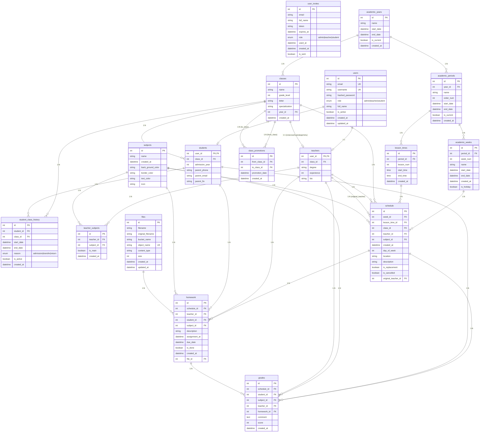

# 🗄️ Схема базы данных школьного дневника

## 📊 ER-диаграмма

## 📋 Описание основных сущностей

### 👥 **Пользователи и роли**
- **`users`** - Основная таблица пользователей (админы, учителя, студенты)
- **`students`** - Профили студентов с контактами родителей
- **`teachers`** - Профили учителей с квалификацией
- **`user_invites`** - Приглашения для регистрации

### 📅 **Академические циклы**
- **`academic_years`** - Учебные годы (2024-2025, 2025-2026)
- **`academic_periods`** - Четверти/семестры
- **`academic_weeks`** - Учебные недели
- **`lesson_times`** - Время уроков (1-й урок: 8:00-8:45)

### 🏫 **Классы и история**
- **`classes`** - Классы (10А, 11Б) с уровнем и специализацией
- **`student_class_history`** - История зачислений и переводов студентов
- **`class_promotions`** - История переводов классов на следующий год

### 📚 **Предметы и преподавание**
- **`subjects`** - Учебные предметы с настройками отображения
- **`teacher_subjects`** - Связь учителей с предметами

### 📅 **Расписание**
- **`schedule`** - Основное расписание уроков
- Поддержка замещений (`is_replacement`, `original_teacher_id`)
- Отмены уроков (`is_cancelled`)

### 📝 **Учебный процесс**
- **`homework`** - Домашние задания с прикрепленными файлами
- **`grades`** - Оценки с комментариями
- **`files`** - Файлы для домашних заданий

## 🔗 Ключевые особенности схемы

### ✅ **Преимущества:**
1. **Гибкость переводов** - полная история изменений классов
2. **Временная структура** - четкая иерархия академических периодов  
3. **Замещения** - поддержка замещающих учителей
4. **Файлы** - прикрепление материалов к заданиям
5. **Роли** - разграничение доступа по ролям

### 🎯 **Основные связи:**
- Один учитель может вести несколько предметов
- Один класс привязан к одному учебному году
- Студент может иметь историю в нескольких классах
- Домашние задания привязаны к конкретному уроку в расписании
- Оценки могут быть как за домашние задания, так и за работу на уроке 